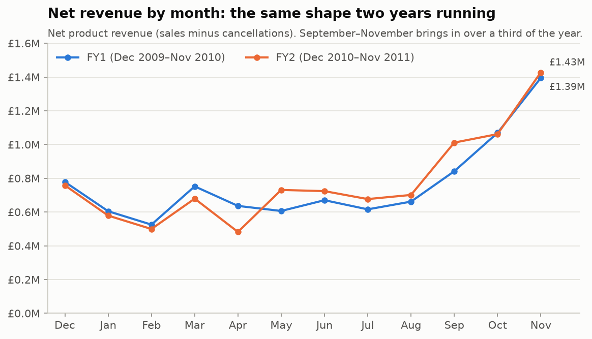
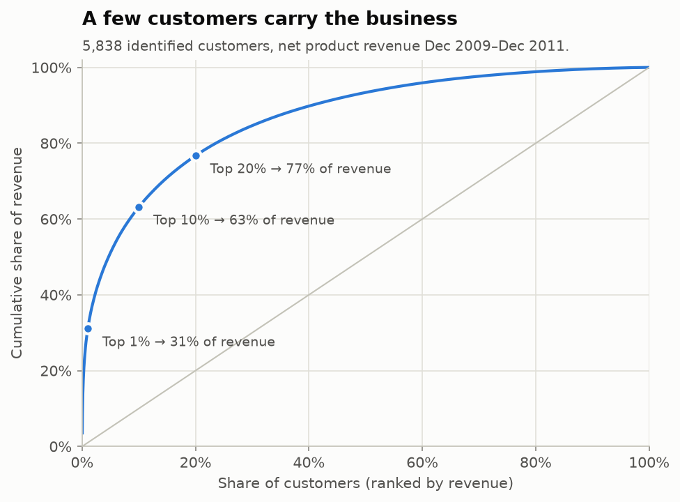
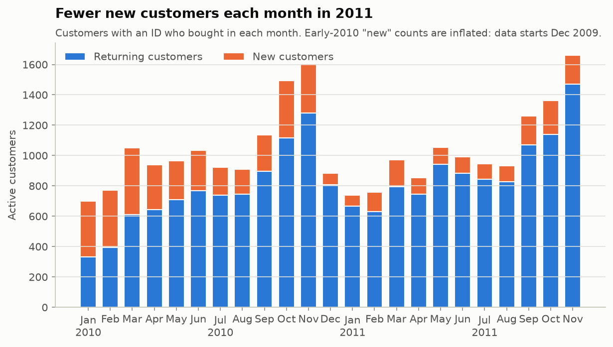
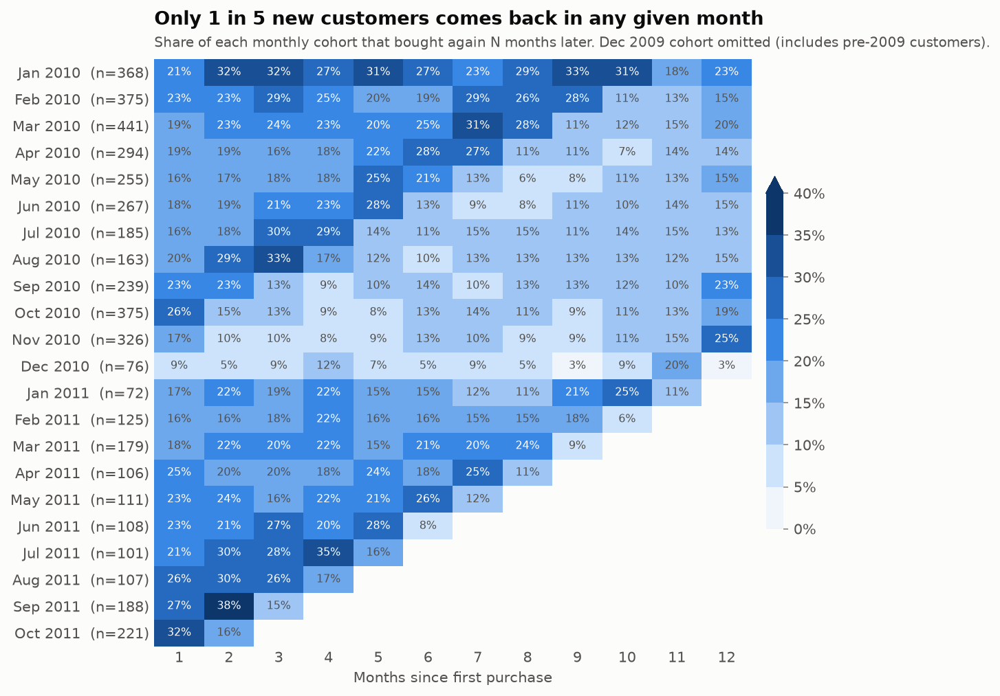
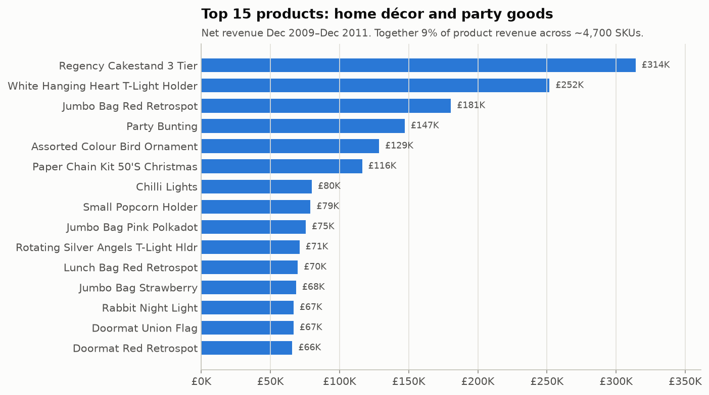
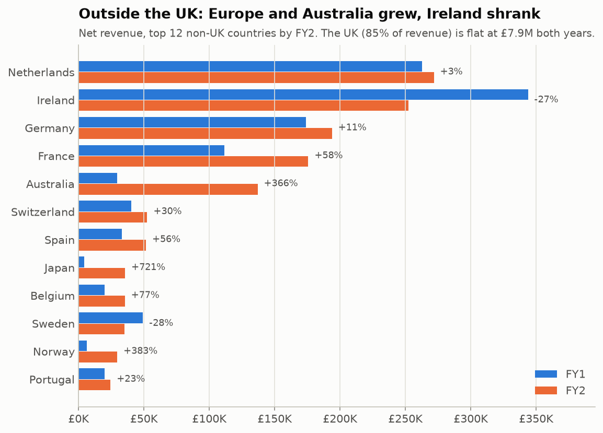
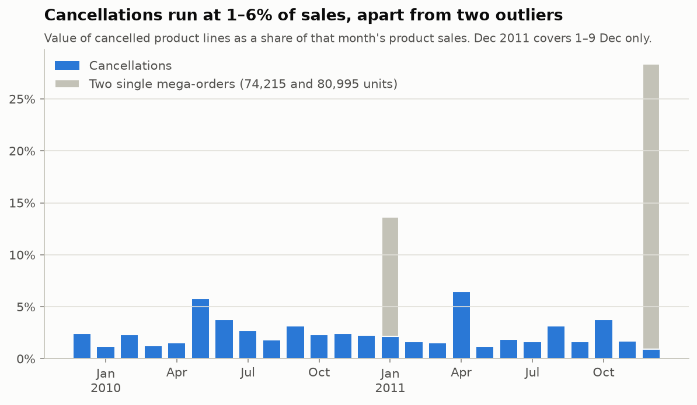
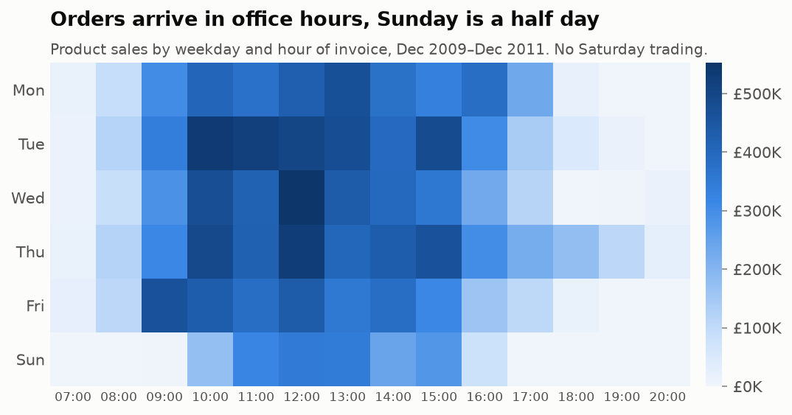

# Business Health Report: UK Online Giftware Retailer

Covers Dec 2009 to 9 Dec 2011. Written 2026-09-27. Charts are in `outputs/charts/`. To reproduce every chart and headline figure, run `python scripts/analyze_business.py`.

## Verdict

**The business is stable, but it isn't growing.** Net revenue rose **1.9%** year on year, to £9.33M. That growth came from less than a quarter of the business: overseas accounts and a fast-growing web/guest channel. The UK trade customer base, which is most of the company, was **flat**.

Four things need attention:

1. **Fewer new customers.** Monthly new-customer counts in 2011 ran well below 2010, so the company depends on keeping the customers it already has.
2. **Too much revenue sits with too few customers.** The top 1% of customers bring in 31% of revenue. Ireland and the Netherlands are each essentially one or two accounts.
3. **Amazon fees are a new cost.** They appeared in Nov 2010 and cost about **£192K** in FY2, which is about 2% of revenue.
4. **The existing customer base is shrinking.** Customers kept from FY1 spent **7% less** in FY2. Customers who left took £1.05M of annual revenue with them.

The good news: seasonality is highly predictable, cancellations are low (2–3% of sales), and orders are getting bigger.

> **Scope and definitions.**
> - All figures are based on the data profile in `outputs/data_profile.md`. In memory only, I removed the rows the two sheets share and the exact duplicate lines.
> - **Product sales:** real product lines only, with quantity > 0 and price > 0. This excludes postage, fees and adjustments.
> - **Net revenue:** product sales minus product cancellations.
> - Years run December to November, so both are complete 12-month periods: **FY1 = Dec 2009–Nov 2010**, **FY2 = Dec 2010–Nov 2011**. Dec 2011 has only 9 days of data and is excluded from year-on-year comparisons.
> - The data has no cost information, so this report covers revenue, not profit.

## 1. Headline scorecard

| Metric | FY1 | FY2 | Change |
|---|---:|---:|---:|
| Net revenue | £9.16M | £9.33M | **+1.9%** |
| Product sales (before cancellations) | £9.40M | £9.63M | +2.5% |
| Orders (invoices) | 19,743 | 18,957 | **−4.0%** |
| Average order value | £476 | £508 | **+6.8%** |
| Identified customers | 4,239 | 4,293 | +1.3% |
| Units sold | 5.63M | 5.25M | −6.7% |
| Revenue per unit | £1.67 | £1.84 | +9.9% |
| Lines per order | 24.3 | 26.3 | +7.8% |
| Revenue from guests (no Customer ID) | £1.06M | £1.41M | **+32%** |
| Revenue from identified customers | £8.33M | £8.22M | −1.3% |

In short, fewer orders, but each one is larger and more expensive per unit. More items per order and a shift toward pricier products explain the higher revenue per unit; list prices didn't rise. Of products sold in both years, 27% had a *lower* median price in FY2 and only 10% had a higher one.

## 2. Revenue trends

- **Sales are very seasonal, and the pattern repeats.** September to November brings in 36–38% of annual revenue. November is the peak both years (£1.39M, then £1.43M), and January–February is the low point. Customers are mostly retailers stocking up for Christmas, so the season arrives early.
- **FY2 gained ground in May–September** (+£0.45M against FY1) and gave it back in March–April (−£0.23M).
- **April 2011 was the weakest month in two years (£0.48M).** It had four fewer trading days (Good Friday, Easter Monday, the royal wedding bank holiday on 29 Apr, and 2 May) and a £23K cancellation. This was calendar and one-off noise, not lost demand.
- **Don't read December 2011 as a trend.** It covers only 9 days and includes one 80,995-unit order (£168K) that was cancelled 12 minutes later.

Table view: monthly net revenue (£K)

| Month | FY1 | FY2 |
|---|---:|---:|
| Dec | 778 | 758 |
| Jan | 605 | 579 |
| Feb | 525 | 499 |
| Mar | 752 | 679 |
| Apr | 636 | 482 |
| May | 606 | 731 |
| Jun | 670 | 724 |
| Jul | 616 | 677 |
| Aug | 662 | 701 |
| Sep | 842 | 1,011 |
| Oct | 1,069 | 1,062 |
| Nov | 1,394 | 1,427 |

## 3. Customers

### Few customers bring in most of the revenue

| Customer group | Share of net revenue |
|---|---:|
| Top 1% (~58 customers) | 31% |
| Top 10% | 63% |
| Top 20% | 77% |
| Bottom 50% | ~7% |

This is a B2B wholesale business. The median customer placed 3 orders worth £856 in total over two years. The largest account (18102, UK) spent £581K. The top 10 customers produce 13% of product sales, and that share was the same in both years. Losing any one of the top 5 would wipe out a full year of growth.

### New customers are slowing down

- New identified customers per month fell from 160–440 in 2010 to 70–220 in 2011. Part of the 2010 figure is inflated: the data starts in Dec 2009, so a long-standing customer's first 2010 order counts as "new". Even so, peak season shows a real drop: Sep–Nov brought **940** new customers in 2010 and only **600** in 2011.
- The returning-customer bars in 2011 are about the same height as in 2010. The customer base is holding its size, not growing.

### Retention and churn

- **Year-on-year:** of the 4,239 customers who bought in FY1, **2,708 (64%) bought again in FY2.** How FY1 revenue became FY2 revenue:

  | Component | Revenue |
  |---|---:|
  | FY1 identified-customer sales | £8.33M |
  | − revenue from customers who left (1,531 of them) | −£1.05M |
  | − retained customers spending less (£7.28M → £6.78M) | −£0.50M |
  | + new customers in FY2 (1,585 of them) | +£1.45M |
  | **= FY2 identified-customer sales** | **£8.22M** |

- **Monthly cohorts:** after their first purchase, typically 15–25% of a cohort buys again in any given month. Cohorts acquired in the Oct–Dec 2010 peak retain worst: the Dec 2010 cohort mostly runs at 3–9%. Seasonal gift buyers rarely come back until the next Christmas. The strong 12-month bump in the Sep–Nov 2010 cohorts confirms this.
- **27.6% of identified customers bought only once.**
- **At-risk revenue:** **735 customers** with 3 or more past orders haven't bought in over 180 days. They spent **£1.6M** in total. That's a concrete win-back list.

## 4. Products

- **The range is broad, with a long tail.** About 4,700 products sold in the period. **1,037 of them (22%) produce 80% of revenue**, and 2,429 products (51%) together produce the last 5%. The top 15 add up to only 9%, so no single product is critical.
- **The best sellers are home décor and party goods.** Regency Cakestand 3 Tier (£314K), White Hanging Heart T-Light Holder (£252K), Jumbo Bag Red Retrospot (£181K), Party Bunting (£147K). Bags make up about 10% of revenue, "heart" items about 10%, and lights/candles about 9%.
- **New products drive growth.** 652 products first sold in FY2 brought in **£1.95M, about 21% of FY2 revenue.** Top launches: Rabbit Night Light £57K, Spotty Bunting £42K, Jumbo Bag Vintage Doily £40K, and the Regency / Pantry cake tins £65K combined.
- **Some long-time best sellers are fading.** White Hanging Heart T-Light Holder fell from £152K to £97K (−£55K), the largest drop of any product. Also down: Red Retrospot Cake Stand (−£23K), Rotating Silver Angels T-Light Holder (−£21K), Union Flag doormat (−£16K). Tea Time Cake Stand went from £25K to zero, so it was delisted.
- The number of products sold fell from 4,055 in FY1 to 3,789 in FY2. The range is being trimmed.

## 5. Geography

- **The UK is 85% of revenue and didn't grow** (£7.89M → £7.88M). **All of the net growth came from outside the UK:** non-UK revenue rose from £1.27M to £1.45M (+14%).
- **Growing markets:**
  - France: +58%, to £176K.
  - Germany: +11%, to £194K.
  - Spain: +56%.
  - Belgium: +77%.
  - Australia: +366%, to £137K. **One customer (12415) accounts for 86% of Australian revenue.**
- **Shrinking markets:**
  - **Ireland: −27%, to £252K.** Ireland is really **two customers** (14156 and 14911 = 98% of Irish revenue), and 14156 cut spending from £187K to £117K.
  - Sweden: −28%.
  - Denmark: −61%.
- **Netherlands (£272K) is one account:** customer 14646 is 96% of it.
- **Overseas orders are bigger.** Median order value is £694 for Ireland and £657 for the Netherlands, against £295 for the UK. Germany and France sit around £360.

**What this means:** the growth markets are real, but most of them rest on one account each. Treat Ireland, the Netherlands and Australia as key-account relationships, not as markets.

## 6. Cancellations

| | FY1 | FY2 | FY2 excluding the 74,215-unit order |
|---|---:|---:|---:|
| Cancelled product value | £241K | £302K | £225K |
| As a share of product sales | 2.6% | 3.1% | **2.3%** |
| Cancellation invoices | 3,983 | 3,285 | — |

- **Cancellations are low and falling slightly** once the one extreme order is removed. Most months sit between 1% and 4%. The highest were May 2010 (5.7%) and April 2011 (6.4%, driven by one £23K doormat cancellation).
- **Cancellation value comes from a few invoices:** the 10 largest account for **44%** of the total.
- **Two oversized orders were entered and cancelled within minutes:**
  - 74,215 × Medium Ceramic Top Storage Jar (18 Jan 2011, customer 12346).
  - 80,995 × Paper Craft Little Birdie (9 Dec 2011, customer 16446).

  Both look like data-entry errors. They inflate gross sales by £246K and should be excluded from any analysis of gross sales or volume.
- **By country:** Spain cancels 13% of its sales value and France 5.7%, against 3.8% for the UK. **12 customers** with more than £5K of sales cancel over 20% of it. These are worth a service review.
- **By product:** Fairy Cake Flannel (26%), Feltcraft Doll Molly (18%), Tea Time Party Bunting (16%) and Colour Glass Star T-Light Holder (16%) have unusually high cancellation rates for products with over £20K in sales. That could point to quality or listing problems.

## 7. Unusual findings

1. **A consumer web channel is growing inside the data.** Orders without a Customer ID are mostly "dotcom" orders: invoices with dotcom postage (`DOT`) produced £2.08M, almost all with no customer. Dotcom postage income grew **80%** (£104K → £186K), and guest revenue grew 32%, much faster than the identified customer base. Because these customers have no ID, the fastest-growing channel can't be analysed at customer level.
2. **Amazon is a new, significant cost.** `AMAZONFEE` lines start in Nov 2010: **£192K in FY2**, £29K in the first 9 days of Dec 2011 alone, and heaviest around peak season. The data doesn't identify which sales came through Amazon, so the channel's profitability can't be checked here.
3. **Bad-debt write-offs of £137K in FY1**, then £11K in FY2. Three large write-offs in Apr–Oct 2010 suggest one or more trade customers defaulted. Credit control seems to have improved.
4. **Manual adjustments (`M`) grew** from −£14K to −£69K. These are hand-keyed credits, including a single £38,970 credit. They deserve an audit trail.
5. **Trading calendar:**
   - Closed on Saturdays: the only Saturday with any orders in two years is 5 Dec 2009.
   - Open on Sundays, but only 10:00–16:00; Sunday is about 9% of sales.
   - Busiest from Tuesday to Thursday, 10:00–15:00.
   - Thursday is the only day with meaningful orders after 17:00, which looks like late opening.

   

6. **Key accounts can swing sharply.** Customer 17450 grew from £50K to £193K and 12415 (Australia) from £19K to £125K. Meanwhile 13694 halved (£131K → £62K) and 14156 (Ireland) fell by £70K. Year-on-year results depend heavily on a handful of relationships.

## 8. Recommendations

1. **Protect the top accounts.** Set up account management and early-warning alerts for the ~60 customers who produce 31% of revenue, especially 14156, 13694 and the single-account markets (Ireland, Netherlands, Australia).
2. **Run a win-back campaign** for the 735 lapsed repeat customers (£1.6M historic spend) before the September buying season.
3. **Put new-customer acquisition back in the plan.** It fell by about a third in peak season, and new products are carrying growth. Target overseas wholesale in France, Germany, Spain and Belgium, where growth is spread across many customers.
4. **Capture customer IDs on dotcom and guest orders.** That channel is growing fastest and can't be analysed today.
5. **Check whether Amazon pays off.** Match `AMAZONFEE` against the sales it generated. £192K a year in fees equals about 13% of what the new FY2 customers brought in.
6. **Add order-entry controls:** a maximum-quantity check (to prevent another 80,995-unit order) and an approval step for manual credits over £1K.
7. **Look into the products and countries with high cancellation rates** (Fairy Cake Flannel, Feltcraft Doll Molly; Spain, France).

## Caveats

- There's no cost or margin data, so "health" here means revenue health only.
- 22.8% of lines have no customer. All customer metrics (concentration, retention, churn) cover identified customers only, who produce about 87% of product revenue.
- Customer tenure is cut off on the left: the data starts Dec 2009, so the first cohort and the 2010 "new customer" counts include older customers.
- Cancellations usually can't be matched to their original order. Cancellation rates are measured by month, not by order.
- Exact-duplicate lines (about 11.8K) were dropped on the assumption that they are entry duplicates. If some were real repeat scans, revenue is understated by up to about 1%.
