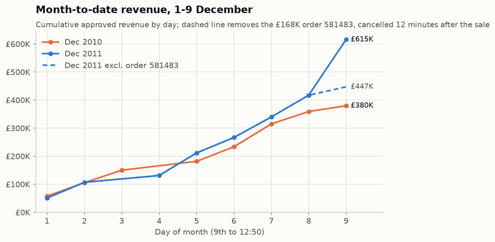
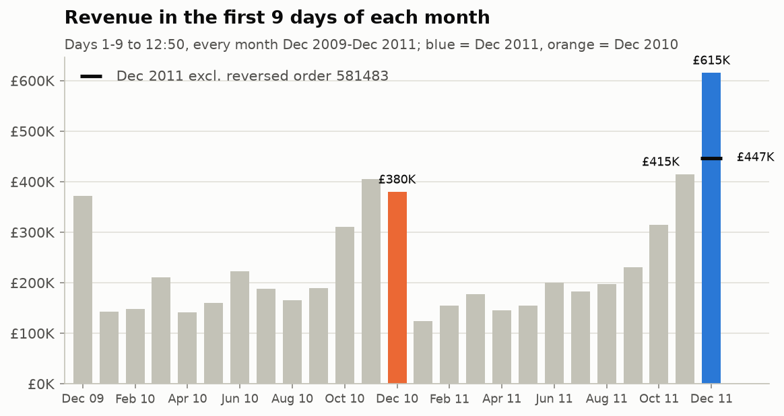
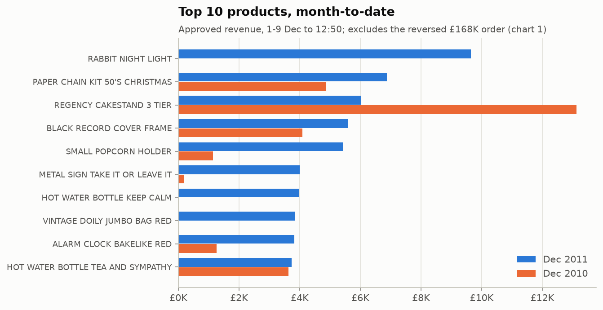
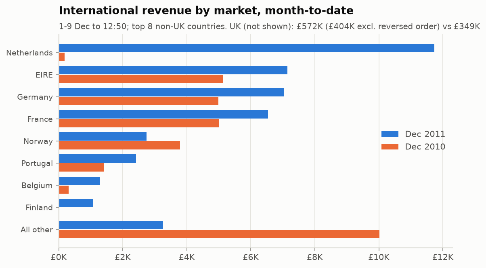

# Monthly Business Review: December 2011 month-to-date

_1-9 Dec 2011 (to 12:50, the last record in the data) vs the same window in Dec 2010 and Nov 2011. Generated 2026-09-27 by `scripts/mbr_analysis.py`. Revenue follows the approved CLAUDE.md definition. All numbers come from `outputs/mbr_2011_12/metrics.json` (cited as `metric`) or the tables in `outputs/mbr_2011_12/` (cited as `file.csv`), unless another source is named._

**Bottom line:** Reported month-to-date revenue is **£615K, up 62% on last year**, but £168K of it is a single 80,995-unit order that was cancelled 12 minutes later. Without that order, revenue is **£447K, up 17.7% on last year and 7.8% on November**. That is a rebound after a flat October and November (+1.3% and +2.2% on the same basis) to the level of August and September (+19.3% and +22.0%). The gain is broad:
- returning customers: +£38K
- new customers: +£15K
- revenue with no Customer ID: +£15K

Eight trading days is a small base, and two accounts give over a third of the gain, so this should not yet be read as the December outcome.

## Scorecard

| KPI | 1-9 Dec 2010 | 1-9 Nov 2011 | 1-9 Dec 2011 | vs last year | vs last month | Evidence |
|---|---|---|---|---|---|---|
| Revenue (approved definition) | £380K | £415K | **£615K** | +62.1% | +48.4% | `revenue` |
| Revenue excl. the reversed order | £380K | £415K | **£447K** | **+17.7%** | **+7.8%** | `revenue_excl_reversed`, `reversals.csv` |
| Orders | 766 | 718 | 816 | +6.5% | +13.6% | `orders` |
| Average order value excl. the reversed order | £496 | £578 | £548 | +10.6% | -5.0% | `aov_excl_reversed` (reported AOV incl. the order: £754) |
| Active customers (with a Customer ID) | 534 | 574 | 614 | +15.0% | +7.0% | `customers` |
| Cancellation rate excl. the reversed order | 1.5% | 2.2% | 1.2% | -0.3 pts | -1.0 pts | `cancel_rate_excl_reversed` (reported: 22.1%) |

_Revenue appears twice, as reported and excluding the reversed order, because the two tell different stories. All three windows have 8 trading days. They start on different weekdays: Thursday (Dec 2011), Wednesday (Dec 2010) and Tuesday (Nov 2011) (`daily.csv`)._

## 3 important changes

1. **Underlying revenue is up £67K (+17.7%) on last year, after about +2% in October and November.** On the same first-nine-days basis, revenue grew +1.3% in October (£315K vs £311K) and +2.2% in November (£415K vs £406K). December returns to the growth seen in August (+19.3%) and September (+22.0%). Over the last 13 months this measure ranged from -15.5% to +22.0%, so December is strong but not exceptional. The weekday mix helps it: the partial 9th is a Friday in 2011 (£29.6K excluding the reversed order) and a Thursday in 2010 (£20.5K). Up to 8 Dec, before that day and before the reversed order, the gain is +16.2% (£417K vs £359K). For the full year, FY2 grew +2.4% (+1.2% without reversed orders). *Evidence: `mtd_trend.csv` (`revenue_excl_reversed_yoy`), `daily.csv` (cum_revenue, reversed_value), `revenue_excl_reversed`; FY figures from `outputs/analysis/metrics.json` `revenue_growth_FY2_vs_FY1`, `revenue_growth_excl_reversed_24h`.*

2. **More orders at a higher basket value, from returning customers and a few large new ones.** Orders rose 6.5% (816 vs 766). Average order value, excluding the reversed order, rose 10.6% (£548 vs £496). Active customers rose 15.0% (614 vs 534). Customers are split the same way in both years: "returning" means they bought in the prior 12 months, "new" means they did not.
   - **Returning customers:** 573 vs 489 (+17.2%), revenue £318K vs £280K (+£38K).
   - **New customers:** fewer, 41 vs 45, but their revenue more than doubled, £26.7K vs £12.1K (+£15K). One new account, customer 16000, spent £12.4K on 7-8 Dec.
   - **No Customer ID:** the remaining +£15K of the gain.

   *Evidence: `orders`, `aov_excl_reversed`, `customers`, `returning_customers_12m_lookback`, `new_customers_12m_lookback`, `returning_12m_revenue_excl_reversed`, `new_12m_revenue_excl_reversed`, `unidentified_revenue_excl_reversed`, `customers.csv`.*

3. **International revenue is up 40% (£43K vs £31K), but that is one Dutch account.** Netherlands revenue went from £178 to £11.7K, all from customer 14646, a long-standing account buying since Dec 2009 (3 orders in this window). Without the Netherlands, international revenue is about flat at £31.5K vs £30.7K (+2.7%). Underneath that, the main markets grew while the long tail shrank: countries outside the top 8 fell from £10.0K to £3.3K. UK revenue excluding the reversed order grew 15.7% (£404K vs £349K) and drives the headline gain. *Evidence: `international_revenue`, `uk_revenue_excl_reversed`, `countries.csv` (Netherlands row: current minus prior_year gives the ex-Netherlands figure), `customers.csv`.*

## 3 risks

1. **One reversed order is 27% of reported December revenue (£168,470).** Invoice 581483 (80,995 × PAPER CRAFT, LITTLE BIRDIE, customer 16446) was cancelled by C581484 twelve minutes later. The approved definition keeps the sale and drops the cancellation, so the order inflates the reported figures:
   - revenue: +62% reported vs +18% underlying
   - AOV: £754 vs £548
   - cancellation rate: 22.1% vs 1.2%
   - top-10 customer share: 47.1% vs 22.3%

   Any December figure quoted without this caveat overstates performance. *Evidence: `reversals.csv`, `metrics.json` → `reversed_orders_in_windows`, `cancel_rate`, `top10_customer_share_of_identified` / `_excl_reversed`; data_quality_report.md §11.*

2. **The gain rests on eight trading days and two accounts.** Customer 16000 (new, £12.4K) and the Dutch account 14646 (£11.7K vs £0.2K) together give £24.1K of the £67.3K gain, 36%. Single days in these windows range from £20K to £84K, not counting 9 Dec 2011, which carries the reversed order. The Friday-vs-Thursday mix on the 9th adds about £9K. The full-year peak months grew only 0.8-1.5% (Oct-Nov, `business_analysis.md` §3). December's gain may be earlier Christmas ordering rather than extra demand. Do not extrapolate +17.7% to the full month. *Evidence: `customers.csv`, `countries.csv`, `daily.csv`, `mtd_trend.csv`, `outputs/business_analysis.md` §3.*

3. **About 23% of revenue has no Customer ID, so customer figures cover only about three-quarters of the business.** Unidentified revenue was £102K this month-to-date vs £87K last year (+17%). Excluding the reversed order, that is 22.9% of revenue vs 23.0% last year. Including it, the share is 16.6%, but only because the denominator is inflated. This revenue accounts for £15K of the gain and cannot be attributed to new or returning customers. New-customer counts are small (41 vs 45; 81 in November), and some new buyers may sit in the unidentified revenue. *Evidence: `unidentified_revenue_excl_reversed`, `unidentified_share_excl_reversed`, `unidentified_revenue_share`, `new_customers_12m_lookback`; data_quality_report.md §11.*

## Supporting detail

- **Products.** New lines lead the gains. RABBIT NIGHT LIGHT (£9.6K), HOT WATER BOTTLE KEEP CALM (£4.0K) and VINTAGE DOILY JUMBO BAG RED (£3.9K) were not sold in the Dec 2010 window. The biggest faller is REGENCY CAKESTAND 3 TIER, last December's top seller: £6.0K vs £13.1K (-54%). 2,464 products sold vs 2,374. *Evidence: `products.csv`, `products_sold`.*
- **Concentration.** Without the reversed order, the top 10 customers hold 22.3% of identified revenue, vs 25.3% last year. The customer base is slightly less concentrated. *Evidence: `top10_customer_share_excl_reversed`.*
- **UK share** of revenue is 93.0% vs 91.9% last year. The reversed order is a UK order. *Evidence: `uk_share`.*

## Questions for leadership

1. **Order 581483 / C581484:** was this an entry error? Should management reporting show revenue net of same-day reversals? That would change the approved revenue definition, so it needs your sign-off. Until then, reports show both figures.
2. **December step-up:** was there a promotion, earlier Christmas dispatch or catalogue timing that explains +17.7% after a flat Oct-Nov? The answer decides whether to plan the rest of December on +18% or about +2%.
3. **Netherlands account 14646:** is its £11.7K December order new business, or timing moved from another month?
4. **Unidentified revenue (23%):** which channel produces orders without a Customer ID? This limits every customer metric above.

## Basis and caveats

- **Period and method.** The window is 1 Dec 00:00 to 9 Dec 12:50 in each year, and the same days in November. Dec 2010 lies entirely inside the sheet overlap and is counted once: the data-quality check confirmed the two copies are identical and exactly one is kept. Assumptions are listed in `metrics.json` → `assumptions`.
- **Data quality.** Fit for analysis, with caveats (`outputs/data_quality_report.md`, §11 covers these windows). No check failed and every negative quantity is explained.
- **The reversed-order adjustment is a sensitivity, not a new definition.** Reversed = a sale of £5K or more matched to a later cancellation, using the `scripts/retail_analysis.py` matcher without its 24-hour filter. Only order 581483 qualifies, and it was cancelled after 12 minutes. The 614 active customers include 16446, whose only purchase was that order. A broader, any-size, 24-hour match in the data-quality report gives £446,471 vs £379,179, the same +17.7%.
- **Independent review.** The reviewer agent independently recomputed every headline number from the processed data, and they matched. Its three blocking and five should-fix issues are corrected in this version (`outputs/review.md`, `scripts/review_recheck.py`).
